# mahoroba_2018
 <html lang="ja">
 <head>
 <meta charset="UTF-8">
 <title>まほろば_2018</title>

<!--
<link rel="stylesheet" href="../style.css/" type="text/css">
-->
</head>

<body>

<h1><marquee behavior="alternate">!!! まほろばの湯、2018年8月10~11日 !!!</marquee></h1>
                                

<marquee direction="left" scrollamount="15" width="100%">台風13号が通過した翌日の暑さの中、す～さんには極度の体調不良を押してご参加いただきました！</marquee>

<marquee direction="right" scrollamount="20" width="30%">(^_^)/~hada</marquee>

<h3>2018年の記録</h3> 

<a href="https://torokoid.github.io/mahoroba_2018/20180810_001.JPG" target="_blank" class="p">
</a>

<a href="https://torokoid.github.io/mahoroba_2018/20180810_002.JPG" target="_blank" class="p">
</a>

<a href="https://torokoid.github.io/mahoroba_2018/20180810_003.JPG" target="_blank" class="p">
</a>

<a href="https://torokoid.github.io/mahoroba_2018/20180810_004.JPG" target="_blank" class="p">
</a>

<a href="https://torokoid.github.io/mahoroba_2018/20180810_005.JPG" target="_blank" class="p">
</a>

<a href="https://torokoid.github.io/mahoroba_2018/20180810_006.JPG" target="_blank" class="p">
</a>

<a href="https://torokoid.github.io/mahoroba_2018/20180810_007.JPG" target="_blank" class="p">
</a>

<a href="https://torokoid.github.io/mahoroba_2018/20180810_008.JPG" target="_blank" class="p">
</a>

<a href="https://torokoid.github.io/mahoroba_2018/20180810_009.JPG" target="_blank" class="p">
</a>

<a href="https://torokoid.github.io/mahoroba_2018/20180810_010.JPG" target="_blank" class="p">
</a>
<!--

    <ul class="slider-inner">
    </ul>
    <ul class="nav">
    </ul>
    
←

    
→

    

    -->

<!--
  
 -->

<marquee direction="left" scrollamount="15" width="100%">8月10日,11:49、バーベキューセット搬入中の図</marquee>

<h5><a href="https://opa.cig2.imagegateway.net/s/cp/album/cover/GiXChhTZCpS" target="_blank">
非縮小の原画リンク（Canonのサーバー）
</a></h5>
     
<h4>
<a href="https://torokoid.github.io/mahoroba_2018_su" target="_blank">8月16日,す～さんの映像をサブサイトにアップしました。スライドショーで表示します。</a>
</h4>  

<h2>8月26日,し～さんのドラレコ映像リンクをアップしました。</h2>
<h4>
<a href="https://drive.google.com/file/d/1sSax_1GwKyxccm2gtna15z7dAzZlBOgn/view?usp=sharing" target="_blank">高解像度版</a>
<h4>
<a href="https://drive.google.com/file/d/1n5lZczsg8H2Dfhq187ktH6iM_9wnA8j4/view?usp=sharing" target="_blank">低解像度版</a>
</h4>  

<!--

<h3>8月15日,す～さん撮影画像を追加しました。 ↓ 画像はクリックで拡大します。ブラウザの戻るボタンで戻れます。</h3>
<a href="No01.JPG" class="preview">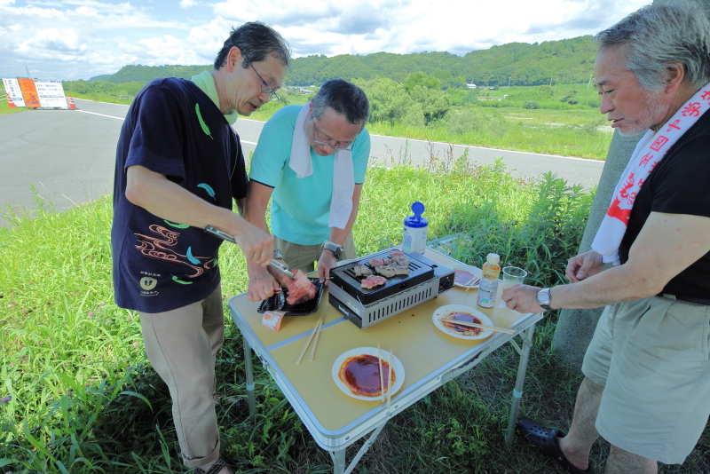</a>
<a href="No02.JPG" class="preview">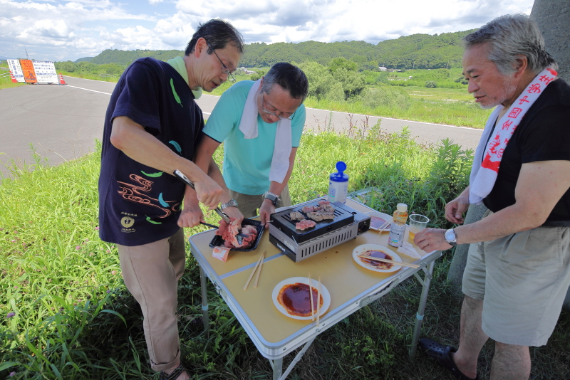</a>
<a href="No03.JPG" class="preview">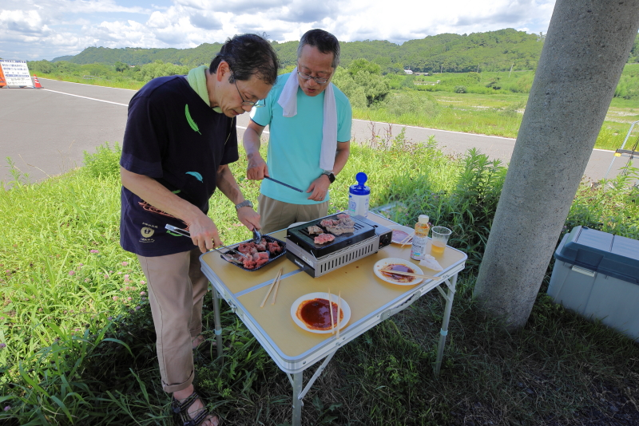</a>
<a href="No04.JPG" class="preview">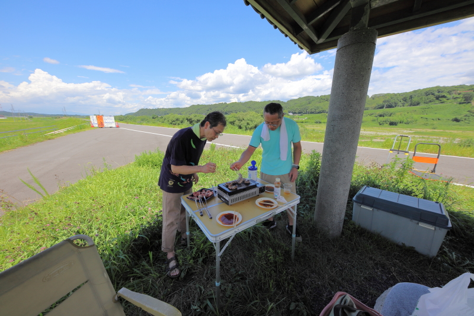</a>
<a href="No05.JPG" class="preview">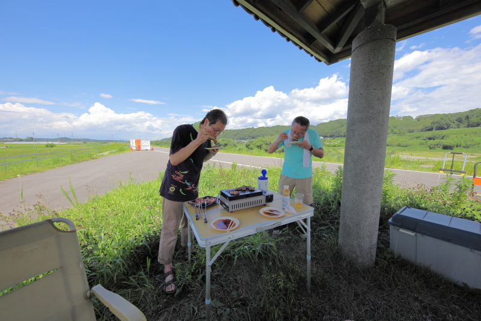</a>
<a href="No06.JPG" class="preview">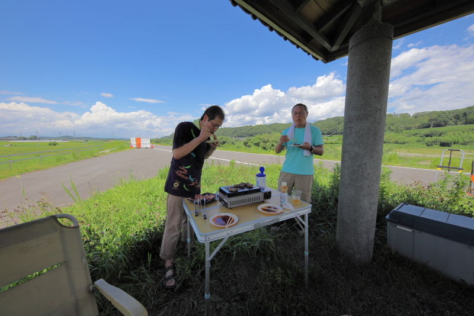</a>
<a href="No07.JPG" class="preview">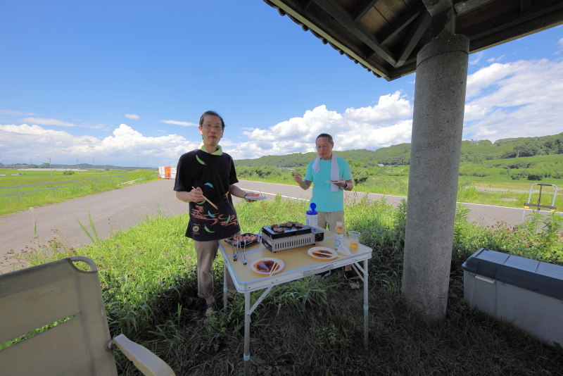</a>
<a href="No08.JPG" class="preview">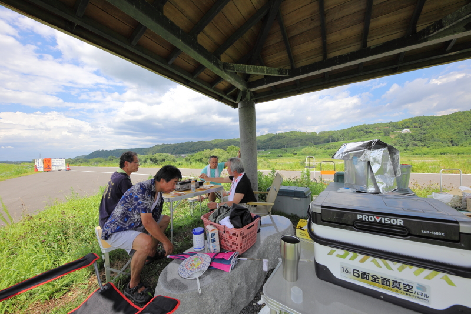</a>
<a href="No09.JPG" class="preview">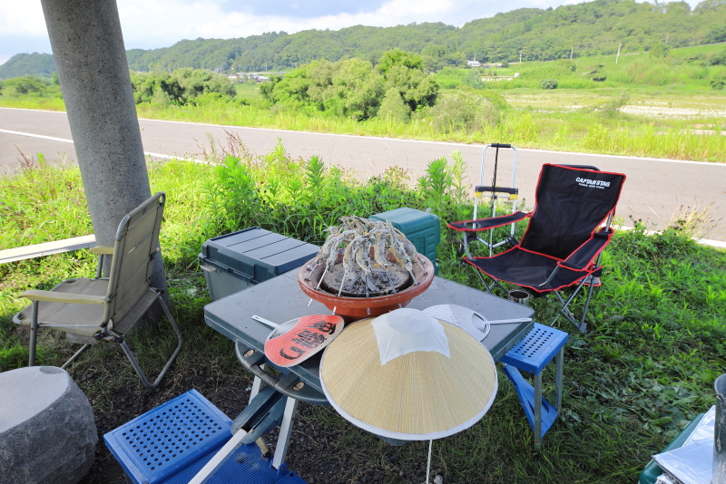</a>
<a href="No10.JPG" class="preview">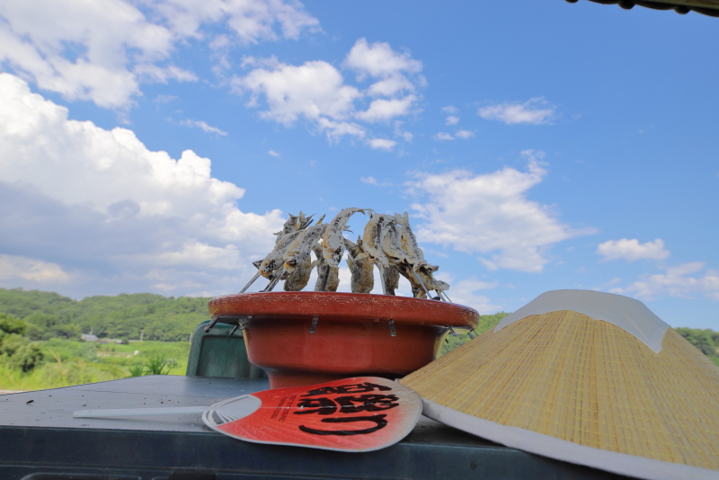</a> 
<a href="No11.JPG" class="preview">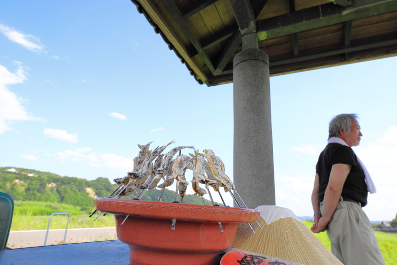</a>
<a href="No12.JPG" class="preview">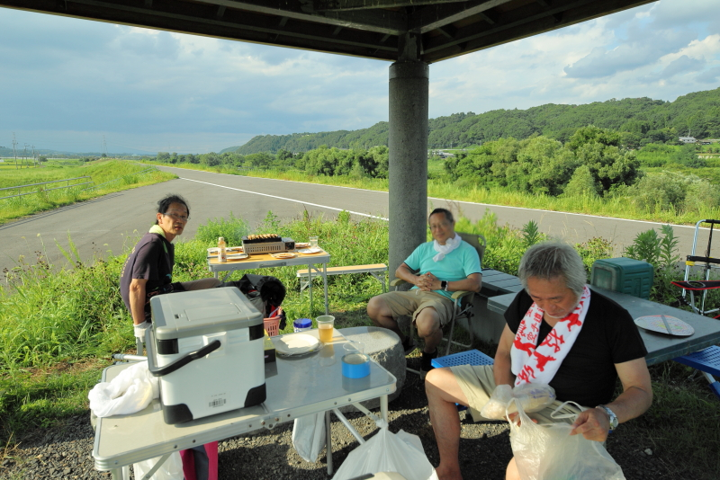</a>

<a href="No14.JPG" class="preview">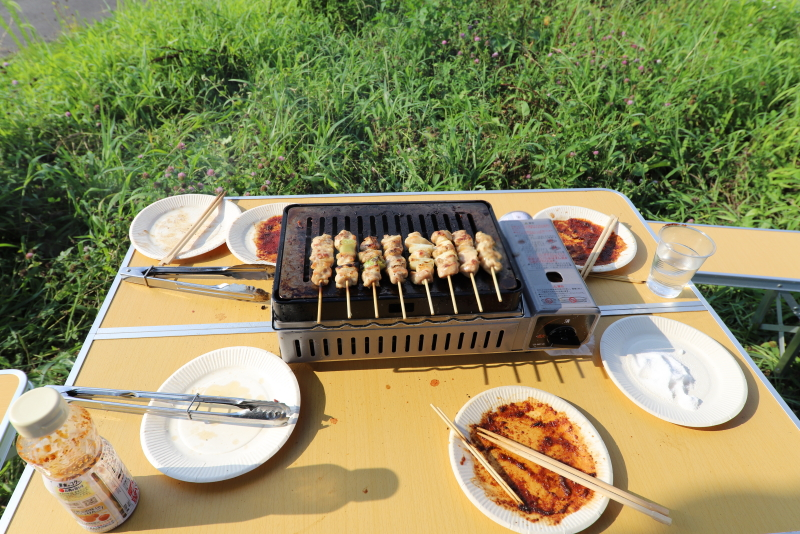</a>
<a href="No15.JPG" class="preview">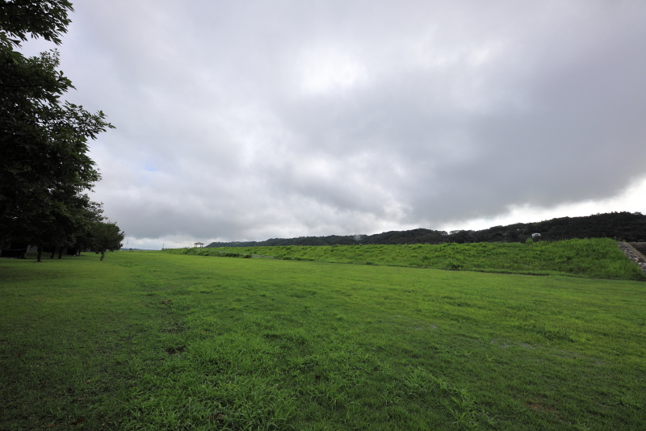</a>
<a href="No16.JPG" class="preview">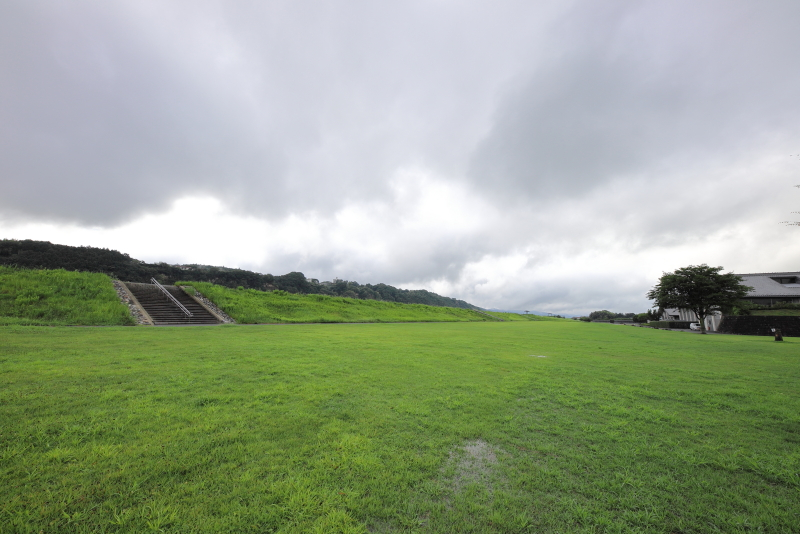</a>
<a href="No17.JPG" class="preview">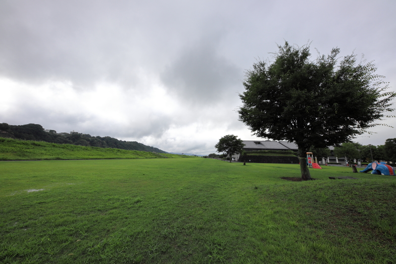</a>
<a href="No18.JPG" class="preview">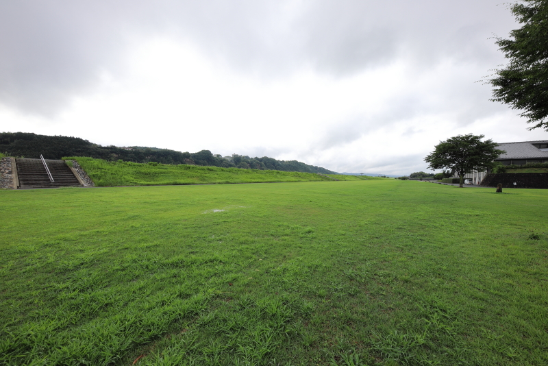</a>
<a href="No19.JPG" class="preview">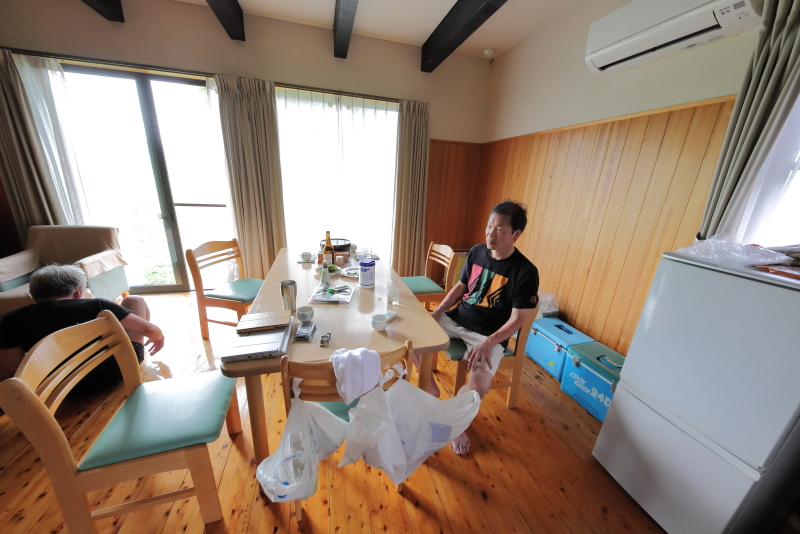</a>
<a href="No20.JPG" class="preview">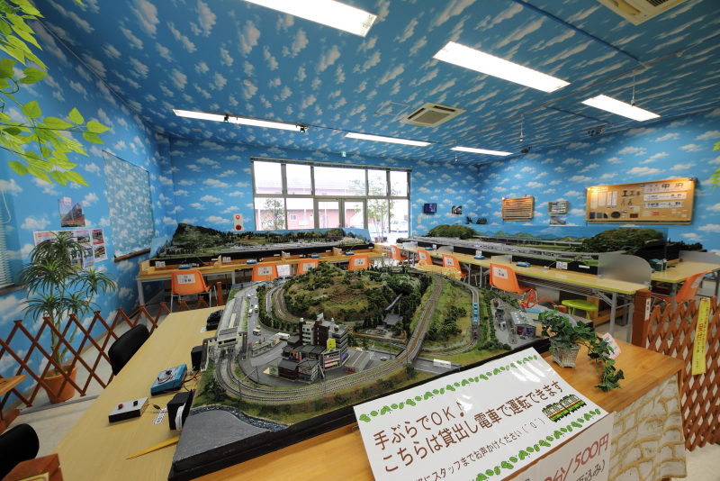</a> 

<a href="No22.JPG" class="preview">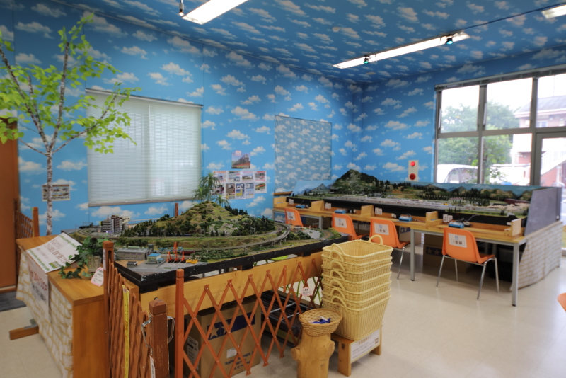</a>

-->
     
     </body>
</html>
<!-- フッタ -->
 <footer>
 Copyright 2018/08/11 S.Hada
 </footer>
